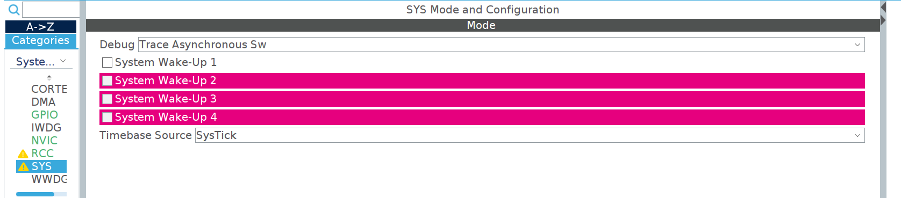
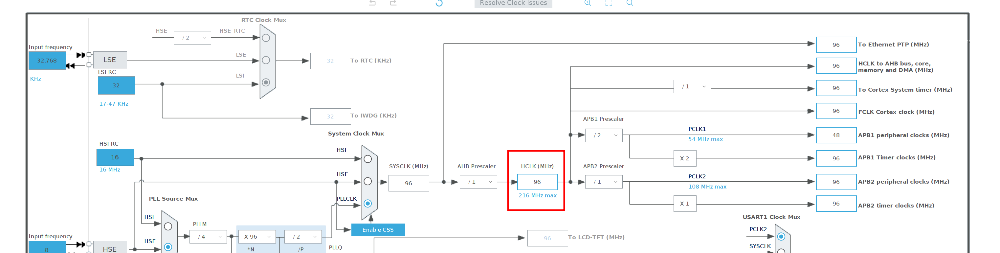
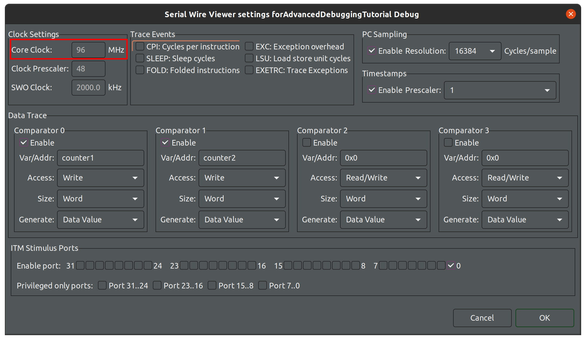

Debugging
=========

The following configuration steps are required to debug using Instrumentation Trace Macrocell (ITM):

1. Select Asynchronous SW Trace:

2. Ensure clock configuration matches trace configuration:

3. Instrumentation Trace Macrocell (ITM) is used in two ways:

- Direct por output.
- As a `printf()` replacement.

~~~c++
#define ITM_Port32(n)	(*((volatile unsigned long *)(0xE0000000+4*n)))

/* */
ITM_Port32(31) = 0x12345678;
~~~

~~~c++
/* USER CODE BEGIN 4 */
int _write(int file, char*ptr, int len)
{
	int DataIdx;
	for(DataIdx=0;DataIdx<len;DataIdx++)
	{
		ITM_SendChar(*ptr++);
	}
	return len;
}
/* USER CODE END 4 */
~~~