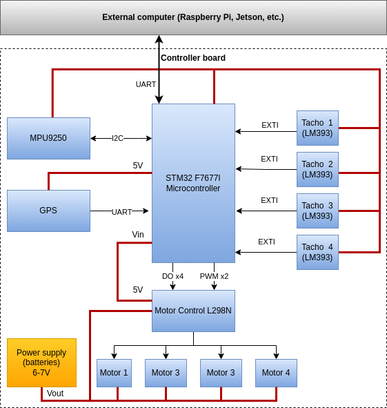

Hardware Setup
==============

Block diagram
-------------

Pin assignment
--------------

Notes: 

- With vehicle facing forward: LF=Left/Front, RB=Right/Back,etc.
- See pinout reference section below (links to image with diagrams are from the Nucleo official site).

### L298N - Nucleo

**Update! pin assignment/color changed!**

| L298N pin | Nucleo pin   | Wire color |
| --------- | ------------ | ---------- |
| ENA       | PB_11 (CN10) | Green      |
| IN1       | PE_10 (CN10) | White      |
| IN2       | PE_12 (CN10) | Green      |
| IN3       | PE_14 (CN10) | White      |
| IN4       | PE_15 (CN10) | Green      |
| ENB       | PB_10 (CN10) | White      |

### L298N - Nucleo

| L298N pin | Motor      | Wire color     |
| --------- | ---------- | -------------- |
| OUT1      | LF, LB (-) | Black          |
| OUT2      | LF, LB (+) | Red            |
| OUT3      | RF,RB(+)   | Red            |
| OUT4      | RF,RB(-)   | Black          |

### Tachometers

**Update! pin assignment/color changed!**

| Nucleo pin    | LM393 pin            | Wire color |
| ------------- | -------------------- | ---------- |
| GND           | GND                  |            |
| 3.3V          | VCC                  |            |
| XXX (CNYY)    | DO (Tacho 1, LF)     | Brown      |
| XXX (CNYY)    | DO (Tacho 2, RF)     | White      |
| XXX (CNYY)    | DO (Tacho  3, LB)    | Blue       |
| XXX (CNYY)    | DO (Tacho 4, LF)     | Green      |

**UPDATE!!* Tachometer pinout changed!!!

### UART (to connect to other computer)

See section below.

### MPU9250

| Nucleo pin           | MPU9250 pin          | Wire color |
| -------------------- | -------------------- | ---------- |
| 3.3V                 | VCC                  | Black      |
| GND                  | GND                  | Grey       |
| PB_8 I2C1_SCL (CN7)  | SCL                  | White      |
| PB_9 I2C_SDA (CN7)   | SDA                  | Purple     |

### GPS

To be completed.

Power supply
------------

- To use external 5V power supply from L298N, set jumper J3 to U5-VIN and connect to Vin.
- To use USB 5V power set J3 jumper to U5V (middle position).

Connection to other computers
-----------------------------

To connect to other computers using UART1 the firmware has to be built with `UartTcTmHandle`  set to `huart1`. 

~~~c++
/* USER CODE END Header_DefaultTaskMain */
void DefaultTaskMain(void *argument)
{
  /* USER CODE BEGIN 5 */
    Config.UartTcTmHandle = &huart3; // Development mode, connected to USB/debbuger.
    //Config.UartTcTmHandle = &huart1; // Production mode
    
    /* ... */
    
    ApplicationMain(&Config);
  /* USER CODE END 5 */
}
~~~

If `huart3` is selected, USB UART will be used instead.

### PC using RS232 TTL USB adapter (pre-production mode)

Builiding the firmware with  `UartTcTmHandle` set to `huart1` (see notes above) and testing one last time against a PC is suggested before closing the chassis.

- **Warning!**: ensure 3.3V mode is selected in the USB adapter.

| Nucleo pin           | External computer    | Wire color |
| -------------------- | -------------------- | ---------- |
| GND                  | GND                  | Black      |
| UART1_RX PB_15 (CN7) | UART_TX              | Red        |
| UART1_TX PB_6 (CN10) | UART_RX              | White      |

### Raspberry Pi and Jetson

Raspberry Pi 3B+/4 are the chosen on board computer options for the low/mid cost configuration. As with the previous option, ensure the firmware is built with  `UartTcTmHandle` set to `huart1` (see notes above). As Jetson Nano has the same pinout as Raspberry Pi, only part of the application software is different.

| Nucleo pin           | Raspberry Pi pin     | Wire color |
| -------------------- | -------------------- | ---------- |
| GND                  | 6 (GND)              |            |
| UART1_RX PB_15 (CN7) | 8 (TXD)              |            |
| UART1_TX PB_6 (CN10) | 10 (RXD)             |            |

**Note**: to use this UART the firmware has to be built with `UartTcTmHandle`  set to `huart1`. If `huart3` is selected, USB UART will be used.

#### Note on UART boot 

There is a caveat with the UART in Ubuntu. This has been observed in Raspberry Pi. The firmware periodically publishes telemetry, which prevents the Raspberry Pi from booting. See [Raspberry Pi setup](RaspberryPiSetup.md) for details.

Nucleo pinout reference (from OS Mbed site)
-------------------------------------------

### Arduino-compatible headers

#### CN8 and CN9

#### CN7 and CN10

### CN11 CN12 headers

